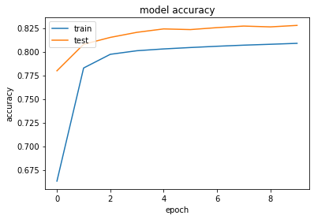
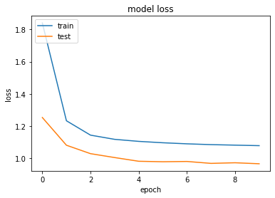

```python
import pathlib
import random
import string
import re
import numpy as np
import tensorflow as tf
from tensorflow import keras
from tensorflow.keras import layers
from tensorflow.keras.layers import TextVectorization
import matplotlib.pyplot as plt
```


```python

with open("corpus_0001.clean.asl.txt", encoding="utf8") as f:
    linesASL = f.read().split("\n")[:-1]
with open("corpus_0001.clean.en.txt", encoding="utf8") as f:
    linesEN = f.read().split("\n")[:-1]

```


```python
print(len(linesASL))
print(len(linesEN))
```

    1060672
    1060672
    


```python

text_pairs = []
for i in range(len(linesASL)):
    glosa = "[start] " + linesASL[i] + " [end]"
    text_pairs.append((linesEN[i], glosa))
```


```python
len(text_pairs)
```


    1060672


```python
for _ in range(5):
    print(random.choice(text_pairs))
```

    ('THIS SILENCE COULD NOT CONTINUE LONG WITHOUT ATTRACTING THE ATTENTION OF THE REST OF THE PARTY ; UPON WHICH MR ARNOLD SAID :', '[start]  THIS SILENCE COULD NOT CONTINUE LONG WITHOUT ATTRACTING ATTENTION-REST-PARTY UPON WHICH MR ARNOLD SAID  [end]')
    ('BUT I SAY   HERE WITHAL IS ONE NOT PHANTASMAL ; OF INDISPUTABLE CERTAINTY   HOME-GROWN   JUST COMMENCING BUSINESS   WHO CARRIED IT FAR !', '[start]  BUT PRO-1 SAY HERE WITHALBEONE NOT PHANTASMAL -INDISPUTABLE CERTAINTY HOME-GROWN JUST COMMENCING BUSINESS wh-q(who)CARRIED PRO-3(it) FAR  [end]')
    ('" SI LES MALADE TOUSSE IL USERA SOIT DE JOUR SOIT DE NUIT PAR PETITES CUILLEREES A CASSE D  UN LOOCH   QUI SERA FAIT AVEC UN ONCE DE SYROP DE VIOLAT ET UN DRAGME DE BLANC DE BALEINE ', '[start]  SI LES MALADE TOUSSE IL USERA SOIT DE JOUR SOIT DE NUIT PAR PETITES CUILLEREES CASSE UN LOOCH QUI SERA FAIT AVEC UN ONCE DE SYROP DE VIOLAT ET UN DRAGME DE BLANC DE BALEINE  [end]')
    ('I WROTE TO YOU LAST WEEK   ASKING YOU TO VISIT ME ', '[start]  PRO-1 WROTE TO PRO-2 LAST WEEK ASKING PRO-2 TO VISIT PRO-1(me)  [end]')
    ('  FROM 1716 TO 1720    [ " BORN 1689 " ( RODENBECK   P ', '[start]  FROM 1716 TO 1720 BORN 1689 RODENBECK  [end]')
    


```python
random.shuffle(text_pairs)
num_val_samples = int(0.15 * len(text_pairs))
num_train_samples = len(text_pairs) - 2 * num_val_samples
train_pairs = text_pairs[:num_train_samples]
val_pairs = text_pairs[num_train_samples : num_train_samples + num_val_samples]
test_pairs = text_pairs[num_train_samples + num_val_samples :]

print(f"{len(text_pairs)} total pairs")
print(f"{len(train_pairs)} training pairs")
print(f"{len(val_pairs)} validation pairs")
print(f"{len(test_pairs)} test pairs")
```

    1060672 total pairs
    742472 training pairs
    159100 validation pairs
    159100 test pairs
    


```python
vocab_size = 15000
sequence_length = 20
batch_size = 64


def custom_standardization(input_string):
    lowercase = tf.strings.lower(input_string)
    return lowercase


eng_vectorization = TextVectorization(
    max_tokens=vocab_size, output_mode="int", output_sequence_length=sequence_length,
)
asl_vectorization = TextVectorization(
    max_tokens=vocab_size,
    output_mode="int",
    output_sequence_length=sequence_length + 1,
    standardize=custom_standardization,
)
train_eng_texts = [pair[0] for pair in train_pairs]
train_asl_texts = [pair[1] for pair in train_pairs]
eng_vectorization.adapt(train_eng_texts)
asl_vectorization.adapt(train_asl_texts)
```


```python
def format_dataset(eng, asl):
    eng = eng_vectorization(eng)
    asl = asl_vectorization(asl)
    return ({"encoder_inputs": eng, "decoder_inputs": asl[:, :-1],}, asl[:, 1:])


def make_dataset(pairs):
    eng_texts, asl_texts = zip(*pairs)
    eng_texts = list(eng_texts)
    asl_texts = list(asl_texts)
    dataset = tf.data.Dataset.from_tensor_slices((eng_texts, asl_texts))
    dataset = dataset.batch(batch_size)
    dataset = dataset.map(format_dataset)
    return dataset.shuffle(2048).prefetch(16).cache()


train_ds = make_dataset(train_pairs)
val_ds = make_dataset(val_pairs)
```


```python
for inputs, targets in train_ds.take(1):
    print(f'inputs["encoder_inputs"].shape: {inputs["encoder_inputs"].shape}')
    print(f'inputs["decoder_inputs"].shape: {inputs["decoder_inputs"].shape}')
    print(f"targets.shape: {targets.shape}")
```

    inputs["encoder_inputs"].shape: (64, 20)
    inputs["decoder_inputs"].shape: (64, 20)
    targets.shape: (64, 20)
    


```python
class TransformerEncoder(layers.Layer):
    def __init__(self, embed_dim, dense_dim, num_heads, **kwargs):
        super(TransformerEncoder, self).__init__(**kwargs)
        self.embed_dim = embed_dim
        self.dense_dim = dense_dim
        self.num_heads = num_heads
        self.attention = layers.MultiHeadAttention(
            num_heads=num_heads, key_dim=embed_dim
        )
        self.dense_proj = keras.Sequential(
            [layers.Dense(dense_dim, activation="relu"), layers.Dense(embed_dim),]
        )
        self.layernorm_1 = layers.LayerNormalization()
        self.layernorm_2 = layers.LayerNormalization()
        self.supports_masking = True

    def call(self, inputs, mask=None):
        if mask is not None:
            padding_mask = tf.cast(mask[:, tf.newaxis, tf.newaxis, :], dtype="int32")
        attention_output = self.attention(
            query=inputs, value=inputs, key=inputs, attention_mask=padding_mask
        )
        proj_input = self.layernorm_1(inputs + attention_output)
        proj_output = self.dense_proj(proj_input)
        return self.layernorm_2(proj_input + proj_output)


class PositionalEmbedding(layers.Layer):
    def __init__(self, sequence_length, vocab_size, embed_dim, **kwargs):
        super(PositionalEmbedding, self).__init__(**kwargs)
        self.token_embeddings = layers.Embedding(
            input_dim=vocab_size, output_dim=embed_dim
        )
        self.position_embeddings = layers.Embedding(
            input_dim=sequence_length, output_dim=embed_dim
        )
        self.sequence_length = sequence_length
        self.vocab_size = vocab_size
        self.embed_dim = embed_dim

    def call(self, inputs):
        length = tf.shape(inputs)[-1]
        positions = tf.range(start=0, limit=length, delta=1)
        embedded_tokens = self.token_embeddings(inputs)
        embedded_positions = self.position_embeddings(positions)
        return embedded_tokens + embedded_positions

    def compute_mask(self, inputs, mask=None):
        return tf.math.not_equal(inputs, 0)


class TransformerDecoder(layers.Layer):
    def __init__(self, embed_dim, latent_dim, num_heads, **kwargs):
        super(TransformerDecoder, self).__init__(**kwargs)
        self.embed_dim = embed_dim
        self.latent_dim = latent_dim
        self.num_heads = num_heads
        self.attention_1 = layers.MultiHeadAttention(
            num_heads=num_heads, key_dim=embed_dim
        )
        self.attention_2 = layers.MultiHeadAttention(
            num_heads=num_heads, key_dim=embed_dim
        )
        self.dense_proj = keras.Sequential(
            [layers.Dense(latent_dim, activation="relu"), layers.Dense(embed_dim),]
        )
        self.layernorm_1 = layers.LayerNormalization()
        self.layernorm_2 = layers.LayerNormalization()
        self.layernorm_3 = layers.LayerNormalization()
        self.supports_masking = True

    def call(self, inputs, encoder_outputs, mask=None):
        causal_mask = self.get_causal_attention_mask(inputs)
        if mask is not None:
            padding_mask = tf.cast(mask[:, tf.newaxis, :], dtype="int32")
            padding_mask = tf.minimum(padding_mask, causal_mask)

        attention_output_1 = self.attention_1(
            query=inputs, value=inputs, key=inputs, attention_mask=causal_mask
        )
        out_1 = self.layernorm_1(inputs + attention_output_1)

        attention_output_2 = self.attention_2(
            query=out_1,
            value=encoder_outputs,
            key=encoder_outputs,
            attention_mask=padding_mask,
        )
        out_2 = self.layernorm_2(out_1 + attention_output_2)

        proj_output = self.dense_proj(out_2)
        return self.layernorm_3(out_2 + proj_output)

    def get_causal_attention_mask(self, inputs):
        input_shape = tf.shape(inputs)
        batch_size, sequence_length = input_shape[0], input_shape[1]
        i = tf.range(sequence_length)[:, tf.newaxis]
        j = tf.range(sequence_length)
        mask = tf.cast(i >= j, dtype="int32")
        mask = tf.reshape(mask, (1, input_shape[1], input_shape[1]))
        mult = tf.concat(
            [tf.expand_dims(batch_size, -1), tf.constant([1, 1], dtype=tf.int32)],
            axis=0,
        )
        return tf.tile(mask, mult)
```


```python
embed_dim = 256
latent_dim = 2048
num_heads = 8

encoder_inputs = keras.Input(shape=(None,), dtype="int64", name="encoder_inputs")
x = PositionalEmbedding(sequence_length, vocab_size, embed_dim)(encoder_inputs)
encoder_outputs = TransformerEncoder(embed_dim, latent_dim, num_heads)(x)
encoder = keras.Model(encoder_inputs, encoder_outputs)

decoder_inputs = keras.Input(shape=(None,), dtype="int64", name="decoder_inputs")
encoded_seq_inputs = keras.Input(shape=(None, embed_dim), name="decoder_state_inputs")
x = PositionalEmbedding(sequence_length, vocab_size, embed_dim)(decoder_inputs)
x = TransformerDecoder(embed_dim, latent_dim, num_heads)(x, encoded_seq_inputs)
x = layers.Dropout(0.5)(x)
decoder_outputs = layers.Dense(vocab_size, activation="softmax")(x)
decoder = keras.Model([decoder_inputs, encoded_seq_inputs], decoder_outputs)

decoder_outputs = decoder([decoder_inputs, encoder_outputs])
transformer = keras.Model(
    [encoder_inputs, decoder_inputs], decoder_outputs, name="transformer"
)
```


```python
encoder.summary()
```

    Model: "model_2"
    _________________________________________________________________
     Layer (type)                Output Shape              Param #   
    =================================================================
     encoder_inputs (InputLayer)  [(None, None)]           0         
                                                                     
     positional_embedding_2 (Pos  (None, None, 256)        3845120   
     itionalEmbedding)                                               
                                                                     
     transformer_encoder_1 (Tran  (None, None, 256)        3155456   
     sformerEncoder)                                                 
                                                                     
    =================================================================
    Total params: 7,000,576
    Trainable params: 7,000,576
    Non-trainable params: 0
    _________________________________________________________________
    


```python
decoder.summary()
```

    Model: "model_3"
    __________________________________________________________________________________________________
     Layer (type)                   Output Shape         Param #     Connected to                     
    ==================================================================================================
     decoder_inputs (InputLayer)    [(None, None)]       0           []                               
                                                                                                      
     positional_embedding_3 (Positi  (None, None, 256)   3845120     ['decoder_inputs[0][0]']         
     onalEmbedding)                                                                                   
                                                                                                      
     decoder_state_inputs (InputLay  [(None, None, 256)]  0          []                               
     er)                                                                                              
                                                                                                      
     transformer_decoder_1 (Transfo  (None, None, 256)   5259520     ['positional_embedding_3[0][0]', 
     rmerDecoder)                                                     'decoder_state_inputs[0][0]']   
                                                                                                      
     dropout_7 (Dropout)            (None, None, 256)    0           ['transformer_decoder_1[0][0]']  
                                                                                                      
     dense_9 (Dense)                (None, None, 15000)  3855000     ['dropout_7[0][0]']              
                                                                                                      
    ==================================================================================================
    Total params: 12,959,640
    Trainable params: 12,959,640
    Non-trainable params: 0
    __________________________________________________________________________________________________
    


```python
epochs = 10  # This should be at least 30 for convergence
transformer.summary()
transformer.compile(
    "rmsprop", loss="sparse_categorical_crossentropy", metrics=["accuracy"]
)
history = transformer.fit(train_ds, epochs=epochs, validation_data=val_ds)
```

    Model: "transformer"
    __________________________________________________________________________________________________
     Layer (type)                   Output Shape         Param #     Connected to                     
    ==================================================================================================
     encoder_inputs (InputLayer)    [(None, None)]       0           []                               
                                                                                                      
     positional_embedding_2 (Positi  (None, None, 256)   3845120     ['encoder_inputs[0][0]']         
     onalEmbedding)                                                                                   
                                                                                                      
     decoder_inputs (InputLayer)    [(None, None)]       0           []                               
                                                                                                      
     transformer_encoder_1 (Transfo  (None, None, 256)   3155456     ['positional_embedding_2[0][0]'] 
     rmerEncoder)                                                                                     
                                                                                                      
     model_3 (Functional)           (None, None, 15000)  12959640    ['decoder_inputs[0][0]',         
                                                                      'transformer_encoder_1[0][0]']  
                                                                                                      
    ==================================================================================================
    Total params: 19,960,216
    Trainable params: 19,960,216
    Non-trainable params: 0
    __________________________________________________________________________________________________
    Epoch 1/10
    11602/11602 [==============================] - 601s 51ms/step - loss: 1.8410 - accuracy: 0.6630 - val_loss: 1.2531 - val_accuracy: 0.7797
    Epoch 2/10
    11602/11602 [==============================] - 603s 52ms/step - loss: 1.2329 - accuracy: 0.7827 - val_loss: 1.0808 - val_accuracy: 0.8078
    Epoch 3/10
    11602/11602 [==============================] - 600s 52ms/step - loss: 1.1435 - accuracy: 0.7972 - val_loss: 1.0284 - val_accuracy: 0.8150
    Epoch 4/10
    11602/11602 [==============================] - 591s 51ms/step - loss: 1.1175 - accuracy: 0.8010 - val_loss: 1.0042 - val_accuracy: 0.8204
    Epoch 5/10
    11602/11602 [==============================] - 595s 51ms/step - loss: 1.1048 - accuracy: 0.8029 - val_loss: 0.9812 - val_accuracy: 0.8240
    Epoch 6/10
    11602/11602 [==============================] - 587s 51ms/step - loss: 1.0962 - accuracy: 0.8043 - val_loss: 0.9781 - val_accuracy: 0.8233
    Epoch 7/10
    11602/11602 [==============================] - 577s 50ms/step - loss: 1.0896 - accuracy: 0.8057 - val_loss: 0.9799 - val_accuracy: 0.8254
    Epoch 8/10
    11602/11602 [==============================] - 578s 50ms/step - loss: 1.0845 - accuracy: 0.8068 - val_loss: 0.9680 - val_accuracy: 0.8270
    Epoch 9/10
    11602/11602 [==============================] - 582s 50ms/step - loss: 1.0814 - accuracy: 0.8078 - val_loss: 0.9718 - val_accuracy: 0.8262
    Epoch 10/10
    11602/11602 [==============================] - 582s 50ms/step - loss: 1.0782 - accuracy: 0.8088 - val_loss: 0.9656 - val_accuracy: 0.8277
    


```python
plt.plot(history.history['accuracy'])
plt.plot(history.history['val_accuracy'])
plt.title('model accuracy')
plt.ylabel('accuracy')
plt.xlabel('epoch')
plt.legend(['train', 'test'], loc='upper left')
plt.show()
```


    

    


```python
plt.plot(history.history['loss'])
plt.plot(history.history['val_loss'])
plt.title('model loss')
plt.ylabel('loss')
plt.xlabel('epoch')
plt.legend(['train', 'test'], loc='upper left')
plt.show()
```


    

    


```python
transformer.evaluate(val_ds, verbose=1)
```

    2486/2486 [==============================] - 51s 20ms/step - loss: 0.9656 - accuracy: 0.8277
    


    [0.9656355381011963, 0.8277386426925659]


```python
asl_vocab = asl_vectorization.get_vocabulary()
asl_index_lookup = dict(zip(range(len(asl_vocab)), asl_vocab))
max_decoded_sentence_length = 20


def decode_sequence(input_sentence):
    tokenized_input_sentence = eng_vectorization([input_sentence])
    decoded_sentence = "[start]"
    sequence = []
    for i in range(max_decoded_sentence_length):
        tokenized_target_sentence = asl_vectorization([decoded_sentence])[:, :-1]
        predictions = transformer([tokenized_input_sentence, tokenized_target_sentence])

        sampled_token_index = np.argmax(predictions[0, i, :])
        sampled_token = asl_index_lookup[sampled_token_index]
        decoded_sentence += " " + sampled_token
        sequence.append(sampled_token)
        if sampled_token == "[end]":
            sequence.pop()
            break
    return sequence


test_eng_texts = [pair[0] for pair in test_pairs]
test_asl_texts = [pair[1] for pair in test_pairs]
for _ in range(30):
    input_sentence = random.choice(test_eng_texts)
    translated = decode_sequence(input_sentence)
    print(translated)
```

    ['[UNK]', 'said', 'kim', 'and', 'held', 'poss-3(he)', 'tongue']
    ['just', 'because', '[UNK]']
    ['frank', '[UNK]', 'ahead', 'turning', 'to', 'pro-3(he)', 'hours']
    ['and', 'yet', 'god', 'wot', 'poss-1', '[UNK]', 'about', 'and', '[UNK]', 'many', '[UNK]', '[UNK]', 'especially', 'company', 'say', 'that', 'pro-1', 'have', '[UNK]', '[UNK]']
    ['mighty', '[UNK]', '[UNK]', 'let', 'this', 'poss-1', 'history', 'become', 'famous', 'throughout', 'world']
    ['boston', 'april', '[UNK]', '[UNK]']
    ['if', 'pro-3(he)', 'cannot', 'breakfast', 'to', 'pay', 'for', 'sugar', 'pro-3(he)', 'must', 'go', 'without', 'sugar']
    ['pro-1', 'knew', 'too', 'that', '[UNK]', 'time', 'in', 'entire', '[UNK]', 'that', '[UNK]', '[UNK]', '[UNK]', '[UNK]', '[UNK]', '[UNK]', '[UNK]', '[UNK]', '[UNK]', '[UNK]']
    ['had', 'an', 'accident', 'then', 'happened', '[UNK]', 'kind', 'never', 'by', 'these', 'beasts', 'would', 'have', 'been', 'in', 'most', '[UNK]', '[UNK]', '[UNK]', '[UNK]']
    ['[UNK]', 'thee', 'gentle']
    ['pro-1', 'lingered', 'some', 'time', 'over', 'poss-1', '[UNK]', 'hearing', '[UNK]', '[UNK]', 'below', '[UNK]', '[UNK]', '[UNK]', 'below', '[UNK]', '[UNK]', '[UNK]', '[UNK]']
    ['pro-1', 'death', 'poss-3(they)', 'situation', 'most', '[UNK]', '[UNK]']
    ['one', '[UNK]', 'words', 'race', 'other', 'human', 'and', '[UNK]', 'to', 'apply', 'practically', 'that', '[UNK]', '[UNK]', '[UNK]']
    ['but', 'gentle', 'sir', 'pro-1(me)', 'thinkes', 'pro-2', 'originally', 'like', 'stranger', 'may', 'pro-1', 'be', 'so', 'bold', 'to', 'know', '[UNK]', '[UNK]', '[UNK]']
    ['[UNK]', 'and', '*', 'whatbethis', 'pro-1', 'hear', 'whispered', '[UNK]']
    ['don', 'tell', 'pro-1(me)', 'pro-2', 'read', 'poss-3(he)']
    ['[UNK]', 'saw', 'pro-1(me)', 'return', 'pro-3(he)', '[UNK]', 'had', 'quitted', 'poss-3(he)']
    ['and', '[UNK]', '[UNK]']
    ['yes', 'that', 'must', 'be', 'sutherlan']
    ['in', 'very', '[UNK]', '[UNK]', 'pro-3(he)', 'can', 'be', 'no', 'other']
    ['poss-2', 'figure', 'and', '[UNK]', 'short', 'distance', 'away', 'attracted', 'poss-1', 'conduct', 'and', 'knowing', 'poss-2', '[UNK]', '[UNK]', '[UNK]']
    ['what', '[UNK]', 'st', 'thou', 'boy', 'looke', 'in', 'ladies', 'face']
    ['pro-3(he)', 'hath', 'arm', 'poss-1(our)', 'answer', 'and', '[UNK]', 'de', 'before', 'pro-3(he)', 'comes', 'yet', 'for', 'poss-1(our)', 'gentlemen', 'that', 'meane', '[UNK]', '[UNK]']
    ['pro-1', 'had', 'no', 'reason', 'to', 'suppose', 'pro-3(he)benot', 'trying', 'these', 'things', 'happen', 'to', '[UNK]', '[UNK]', '[UNK]', '[UNK]', '[UNK]']
    ['come', 'up']
    ['[UNK]', 'ez', '[UNK]', 'disko']
    ['pro-1', 'will', 'pro-1', 'said', '[UNK]', 'drawing', 'poss-1', 'sword', 'but', 'pro-1', 'have', 'done', 'nothing', 'yet']
    ['blessing', 'on', 'thee']
    ['at', 'oxford', 'at', 'least', 'pro-3(he)', 'seems', 'to', 'have', 'been', 'happy', 'pro-3(he)benot', 'rarely', 'knew', '[UNK]', '[UNK]', 'pro-3(he)', 'had', 'been', '[UNK]', '[UNK]']
    ['indeed', 'pro-1(we)', '-', '-', '[UNK]']
    


```python
from nltk.translate.bleu_score import sentence_bleu
```


```python
print(len(test_eng_texts))
```

    159100
    


```python

#TODO otimizar. demora aprox 24hrs analizar 159100
def shapeBLEUReference(string):
    unfiltered = string.lower().replace("[start]", "").replace("[end]","").split(" ")
    return list(filter(lambda text: text != '' and text != ' ', unfiltered))


bleu1 = 0
bleu2 = 0
bleu3 = 0
bleu4 = 0

total = len(test_asl_texts)
for i in range(10):
    input_sentence = test_eng_texts[i]
    translated = decode_sequence(input_sentence)
    reference = [shapeBLEUReference(test_asl_texts[i])]
    print(reference)
    print(translated)
    

for i in range(total):
    input_sentence = test_eng_texts[i]
    translated = decode_sequence(input_sentence)
    reference = [shapeBLEUReference(test_spa_texts[i])]
    b1 = sentence_bleu(reference, translated, weights=(1, 0, 0, 0))
    b2 = sentence_bleu(reference, translated, weights=(0.5, 0.5, 0, 0))
    b3 = sentence_bleu(reference, translated, weights=(0.33, 0.33, 0.33, 0))
    b4 = sentence_bleu(reference, translated, weights=(0.25, 0.25, 0.25, 0.25))
    bleu1 += b1
    bleu2 += b2
    bleu3 += b3
    bleu4 += b4
    
print(bleu1/total)
print(bleu2/total)
print(bleu3/total)
print(bleu4/total)
    
    

```

    [['poss-1', 'lord', 'approaches']]
    ['poss-1', 'lord', 'approaches']
    [['mr', 'andrews', 'experience', 'and', 'vision-lord', 'lyttelton', 'beboth', 'printed', 'in', 'scots', 'magazine', 'december', '1779']]
    ['mr', '[UNK]', 'experience', 'and', '[UNK]', '[UNK]', 'printed', 'in', '[UNK]', 'magazine', 'december', '[UNK]', '[UNK]', '[UNK]', '[UNK]', '[UNK]', '[UNK]', '[UNK]', '[UNK]', '[UNK]']
    [['sir', 'pro-1(we)belegislators', 'not', 'antiquaries']]
    ['sir', '[UNK]', 'not', '[UNK]']
    [['law', 'section', '735', '6th', 'ed']]
    ['law', 'section', '[UNK]', 'rhine', '[UNK]']
    [['wh-q(why)did', 'father', 'kill', 'sheep']]
    ['[UNK]', 'kill', 'sheep']
    [['that', 'night', 'mr', 'cooper', 'poss-3(they)', 'master', 'beto', 'attend', 'party', 'and', 'thisbeposs-3(they)', 'opportunity']]
    ['that', 'night', 'mr', '--', '--', 'mr', '[UNK]', 'attend', 'party', 'and', 'this', '[UNK]', 'looking']
    [['pro-3(he)', 'longedbealone', 'to', 'recover', 'himself']]
    ['pro-3(he)', '[UNK]', 'to', 'world', 'himself']
    [['mrs', 'quiverful', 'thanked', 'poss-3(he)', 'and', 'shook', 'hands', 'with', 'poss-3(he)', 'and', 'looked', 'into', 'poss-3(he)', 'face', 'suspiciously']]
    ['mrs', 'quiverful', 'thanked', 'poss-3(he)', 'and', 'shook', 'hands', 'with', 'poss-3(he)', 'and', 'looked', 'into', 'poss-3(he)', 'face']
    [['lady', 'earle', 'sat', 'for', 'some', 'moments', 'too', 'much', 'astounded', 'for', 'speech']]
    ['lady', 'earle', 'sat', 'for', 'some', 'moments', 'too', 'much', '[UNK]', 'for', 'speech']
    [['but', 'pro-1', 'll', 'get', 'some']]
    ['but', 'pro-1', 'll', 'get', 'some']
    0.6087583190643412
    0.5235357211311377
    0.4154113927127925
    0.3404097806784382
    


```python

```
